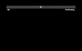

# Desktop App Compatibility Matrix

This matrix tracks apps by architecture and by graphics path. Keep it updated
when a crash is fixed, a new native bridge payload is adopted, or an app changes
major versions.

The desktop ROM intentionally presents a tablet-like, non-telephony feature set
to package managers. Do not expose `android.hardware.type.pc`; Play treats that
as a desktop/PC device and filters some phone/tablet apps before installation.

## Status

| Dot | Meaning |
| --- | --- |
| 🟢 | Works. |
| 🟡 | Works with conditions — a known quirk, or it runs but renders incorrectly. See the Detail column. |
| 🔴 | Does not run. |
| ⚪ | Not yet tested on this release train. |

One row per app. The four dot columns are architecture × graphics path:

- **ARM** — ARM64 ROM  ·  **X86** — x86-64 ROM (ARM-only apps run translated)
- **gfx** — `--gpu_mode=gfxstream`  ·  **agl** — `--gpu_mode=gfxstream_guest_angle` (the default)

Results do not carry across either axis, so grade each cell separately. Grade
graphics from **actual gameplay**: menus and cutscenes frequently render
correctly while the same title is corrupt in-world.

## Matrix

| App | ARM gfx | ARM agl | X86 gfx | X86 agl | Detail |
| --- | :---: | :---: | :---: | :---: | --- |
| Angry Birds 2 | ⚪ | ⚪ | ⚪ | ⚪ | Validate Play Services, GPU, ABI selection |
| Asphalt 8 | 🔴 | 🔴 | 🔴 | 🔴 | Device certification, not graphics-path specific |
| [CarX Drift Racing 3](#carx-drift-racing-3) | 🟢 | 🟢 | 🟢 | ⚪ | Clean in gameplay on every path graded so far; the Unity/ANGLE counterexample |
| [CarX Highway Racing](#carx-highway-racing) | 🟢 | 🟡 | 🟢 | ⚪ | ARM ANGLE corrupts textures in gameplay; clean on X86 gfx (RADV) translated |
| [Chromium](#chromium) | 🟡 | 🟡 | 🟡 | 🟡 | Magenta window title bar under gfxstream |
| [Destiny Rising](#destiny-rising) | 🟡 | 🟢 | ⚪ | ⚪ | Unlit world and black UI panels under gfxstream; clean under ANGLE |
| Nintendo apps | 🔴 | 🔴 | 🔴 | 🔴 | Play Integrity / device attestation |
| No Limit 2 | ⚪ | ⚪ | ⚪ | ⚪ | Needs crash-log retest on each ROM image |
| [Rebel Racing](#rebel-racing) | ⚪ | ⚪ | ⚪ | ⚪ | Sideloaded base.apk stalls at 0% asset download, never reaches gameplay |

## Graphics paths

Guest ANGLE translates GLES to Vulkan; `gfxstream` uses the direct GLES path
instead. Both run against the *host* Vulkan driver, so a result does not carry
across architectures: the ARM64 results below were taken on Apple Silicon
(Honeykrisp), while an x86-64 host runs RADV, ANV or a proprietary driver
instead. Re-grade per architecture rather than assuming. Neither path is clean:

- **Guest ANGLE corrupts compressed textures for some titles.** They decode as
  block noise or vertical stripes while geometry, lighting, text and vector UI
  stay correct. This is per-title, not a property of the path — CarX Highway
  Racing is corrupt in gameplay while CarX Drift Racing 3, also Unity on ANGLE,
  is clean. The trigger is more likely a specific texture format or footprint.
  Apps using Vulkan directly are unaffected.
- **`gfxstream` loses color buffers.** Across app relaunch cycles the renderer
  logs `Failed to find ColorBuffer: <id>` and `TextureDraw: GL error=0x502`,
  after which `adb screencap` returns whole-screen magenta, pure black, or
  hangs. The guest stays responsive and the console keeps receiving frames, so
  the display survives and a VM restart clears it. Note the consequence for
  testing: **a magenta capture in this mode is not by itself a texture fault.**

## Per-app details

### CarX Drift Racing 3

*Left: ARM64 in-world test drive under ANGLE. Right: x86-64 under `gfxstream`,
driving at 61 km/h — foliage, road, car decals and HUD all correct.*

Unity/GLES through ANGLE, but renders correctly in gameplay under both modes,
verified in-world with HUD rather than from the garage menu. Kept here as the
counterexample to "Unity on ANGLE is broken": being a Unity/ANGLE title does not
by itself imply the corruption seen in CarX Highway Racing.

On x86-64 it runs translated through native bridge and is clean under
`gfxstream`, graded while driving rather than parked. It gates gameplay behind
a 773 MB in-game asset download on a fresh install, so budget for that before
the first grading run.

### CarX Highway Racing

*Left: ARM64 in-race under `gfxstream`, correct. Middle: the same race under
ANGLE — the billboard is block noise and the road, car body and HUD bar are
striped. Right: x86-64 under `gfxstream`, correct — 61% race distance, 51 MPH,
billboards intact.*

Launches and plays on ARM64. Under `gfxstream_guest_angle` its compressed
textures corrupt in gameplay: roadside billboards become coloured block noise,
and the road surface, car body panels, interior and HUD bar draw as vertical
stripes. Geometry, lighting, text and vector UI stay correct. The same build
renders correctly under `gfxstream`, so the fault is in the guest ANGLE path
rather than the host renderer or the ASTC decoder. Its menus and cutscenes
render correctly in both modes, so grade this one from a race.

On x86-64 the game installs and runs translated through native bridge
(`primaryCpuAbi=arm64-v8a` on an `x86_64,arm64-v8a` device) and renders
correctly in-race under `gfxstream` on RADV, billboards included. Play replaces
a sideloaded copy with its own build on first launch, so let that update finish
before grading. The ANGLE cell is still ungraded on this architecture; until it
is, do not assume the ARM64 ANGLE corruption reproduces here, since the two
hosts run different Vulkan drivers.

### Chromium

*Page content, icons and text render correctly under `gfxstream`, but the
window title bar draws magenta — the same invalid-color-buffer artifact
described under Graphics paths. Destiny Rising is visible behind it with the
black UI panels from the same fault.*

### Destiny Rising

*Left: Haven under ANGLE, correct. Right: the same location under
`gfxstream` — the world is unlit and the minimap, quest and nameplate panels
draw as black rectangles.*

Needs three ROM behaviours together:

1. Writable dynamic DEX, for the packed `classes.dex` it unpacks at runtime.
2. UFFD GC disabled on the 16 KiB guest — ART otherwise takes SIGBUS during
   mark-compact heap relocation.
3. Explicit ART null checks, so NetEase CrashHunter cannot intercept ART's
   internal faults and kill the process.

Uses Vulkan directly, so it is unaffected by the ANGLE compressed-texture issue.
Reaches gameplay and streams its multi-GB asset packs. Not yet graded under
`gfxstream`: it launches, but no verified gameplay frame was captured.

### Rebel Racing

*Stalled on the in-game asset download at 0%, never reaching gameplay.*

Requires fullscreen because it opts out of resizing. Newer builds also need a
GmsCore release containing the scoped Play Games server-auth callback. Launches
and holds foreground on ARM64, but a sideloaded `base.apk` on its own stalls on
its in-game asset download at 0% and never reaches gameplay, so it cannot be
graded for graphics under either mode. Install the full split set, or via Play,
to test.

## Release smoke set

1. Open the launcher and app drawer.
2. Launch Settings, Files, F-Droid, Aurora Store, microG Settings, and Chromium.
3. On x86-64, run the bundled static and dynamic ARM64 native-bridge suites,
   then install one representative ARM64-only APK and confirm startup reaches
   app code instead of failing in the linker.
4. Record any app that crashes in this file with the top crash frame and target
   architecture.

Every app categorized as `ApplicationInfo.CATEGORY_GAME` is launched fullscreen
by the desktop compatibility policy, regardless of its `resizeableActivity`
declaration. This preserves the lifecycle, input, and surface assumptions common
to games while non-game applications retain normal desktop windowing.
