# Desktop App Compatibility Matrix

This matrix tracks apps by architecture and by graphics path. Keep it updated
when a crash is fixed, a new native bridge payload is adopted, or an app changes
major versions.

The desktop ROM intentionally presents a tablet-like, non-telephony feature set
to package managers. Do not expose `android.hardware.type.pc`; Play treats that
as a desktop/PC device and filters some phone/tablet apps before installation.

## Status

| Dot | Meaning |
| --- | --- |
| 🟢 | Works. |
| 🟡 | Works with conditions — a known quirk, or it runs but renders incorrectly. See the Detail column. |
| 🔴 | Does not run. |
| ⚪ | Not yet tested on this release train. |

One row per app. The four dot columns are architecture × graphics path:

- **ARM** — ARM64 ROM  ·  **X86** — x86-64 ROM (ARM-only apps run translated)
- **gfx** — `--gpu_mode=gfxstream`  ·  **agl** — `--gpu_mode=gfxstream_guest_angle` (the default)

Results do not carry across either axis, so grade each cell separately. Grade
graphics from **actual gameplay**: menus and cutscenes frequently render
correctly while the same title is corrupt in-world.

## Matrix

| App | ARM gfx | ARM agl | X86 gfx | X86 agl | Detail |
| --- | :---: | :---: | :---: | :---: | --- |
| [Angry Birds 2](#angry-birds-2) | ⚪ | 🟢 | ⚪ | ⚪ | ARM agl verified in a live level; X86 gfx not gradable, no level entry point found |
| [Asphalt 8](#asphalt-8) | ⚪ | 🟢 | 🟡 | ⚪ | X86 gfx: HUD live, 3D world black. ARM agl: confirmed clean mid-race |
| [CarX Drift Racing 3](#carx-drift-racing-3) | 🟢 | 🟢 | 🟢 | ⚪ | Clean in gameplay on every path graded so far; the Unity/ANGLE counterexample |
| [CarX Highway Racing](#carx-highway-racing) | 🟢 | 🟡 | 🟢 | 🟢 | ANGLE corruption is Honeykrisp-specific: clean on X86 (RADV) under both paths |
| [Chromium](#chromium) | 🟡 | 🟡 | 🟡 | 🟡 | Magenta window title bar under gfxstream |
| [Destiny Rising](#destiny-rising) | 🟡 | 🟢 | 🟢 | ⚪ | ARM gfx draws an unlit world and black UI panels; X86 gfx is clean, so that fault is not gfxstream-wide |
| [Google Play](#google-play) | ⚪ | ⚪ | 🟢 | ⚪ | The install path for every other row; verify it is signed in before grading anything |
| Nintendo apps | 🔴 | 🔴 | 🔴 | 🔴 | Play Integrity / device attestation |
| [No Limit Drag Racing 2](#no-limit-drag-racing-2) | ⚪ | ⚪ | 🟢 | ⚪ | Clean in-race on X86 gfx; launch needs two-finger input adb cannot inject |

## Graphics paths

Guest ANGLE translates GLES to Vulkan; `gfxstream` uses the direct GLES path
instead. Both run against the *host* Vulkan driver, so a result does not carry
across architectures: the ARM64 results below were taken on Apple Silicon
(Honeykrisp), while an x86-64 host runs RADV, ANV or a proprietary driver
instead. Re-grade per architecture rather than assuming. Neither path is clean:

- **Guest ANGLE corrupts compressed textures on Honeykrisp, not on RADV.**
  CarX Highway Racing decodes billboards, car body panels, interior and HUD bar
  as block noise or vertical stripes under `gfxstream_guest_angle` on Apple
  Silicon (Honeykrisp), with geometry, lighting, text and vector UI staying
  correct. The same build of the same title is clean under the same graphics
  path on x86-64 (RADV), graded in-race at both 54 and 47 MPH. That rules out
  the path itself, the game, and ASTC emulation (already isolated separately,
  see the per-app detail below) as the cause, and narrows it to something in
  ANGLE's interaction with the Honeykrisp Vulkan driver specifically. CarX
  Drift Racing 3, also Unity on ANGLE, stays clean on both hosts, so whatever
  the trigger is, it depends on the specific texture format or footprint a
  title uses, not on the engine or the path alone. Apps using Vulkan directly
  are unaffected on either host.
- **`gfxstream` loses color buffers.** Across app relaunch cycles the renderer
  logs `Failed to find ColorBuffer: <id>` and `TextureDraw: GL error=0x502`,
  after which `adb screencap` returns whole-screen magenta, pure black, or
  hangs. The guest stays responsive and the console keeps receiving frames, so
  the display survives and a VM restart clears it. Note the consequence for
  testing: **a magenta capture in this mode is not by itself a texture fault.**

## Per-app details

### Angry Birds 2

<a href="images/angry-birds-2-gameplay-full.jpg">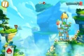</a>

*In a live level under ANGLE: slingshot, physics props, score counter, all correct.*

Installs from Play without being filtered out, and renders correctly under ANGLE
through the flock-select menu and into a live level.

First attempt stalled behind a Rovio-side "You are offline" gate that survived
repeated Retry taps despite the guest having fully validated connectivity (ICMP,
DNS, and clock all fine). Root cause was network-level, not the ROM or the app:
this LAN's DHCP-assigned DNS servers sinkhole `fundingchoicesmessages.google.com`
(and other ad/tracker domains) to `0.0.0.0` / `127.0.0.1`, most likely a Pi-hole or
AdGuard Home-style blocklist. Rovio's TCF consent SDK depends on that Google
ad-consent domain before its own offline-checker will let the menu proceed, so it
misreports a filtered DNS answer as no connectivity at all.

Worked around by pointing only the guest at Private DNS (`dns.google`), leaving the
host and router untouched:

```
adb shell settings put global private_dns_mode hostname
adb shell settings put global private_dns_specifier dns.google
```

That setting is still active on this guest. Worth knowing for any app depending on a
domain your network's DNS filters: a false "you are offline" here is a testing
environment artifact, not a ROM defect, and it is worth checking DNS resolution of
the specific failing host before concluding an app is broken.

### CarX Drift Racing 3

<a href="images/carx-drift-racing-3-full.jpg">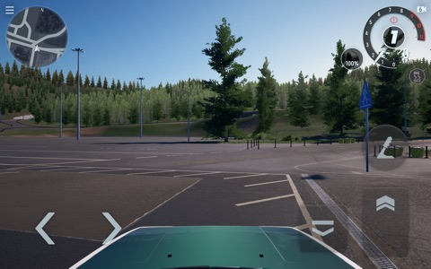</a>
<a href="images/carx-drift-racing-3-x86-gfxstream-full.jpg">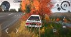</a>

*Left: ARM64 in-world test drive under ANGLE. Right: x86-64 under `gfxstream`,
driving at 61 km/h — foliage, road, car decals and HUD all correct.*

Unity/GLES through ANGLE, but renders correctly in gameplay under both modes,
verified in-world with HUD rather than from the garage menu. Kept here as the
counterexample to "Unity on ANGLE is broken": being a Unity/ANGLE title does not
by itself imply the corruption seen in CarX Highway Racing.

On x86-64 it runs translated through native bridge and is clean under
`gfxstream`, graded while driving rather than parked. It gates gameplay behind
a 773 MB in-game asset download on a fresh install, so budget for that before
the first grading run.

### CarX Highway Racing

<a href="images/carx-highway-gfxstream-full.jpg">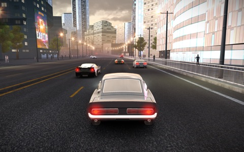</a>
<a href="images/carx-highway-angle-full.jpg">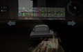</a>
<a href="images/carx-highway-x86-gfxstream-full.jpg">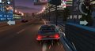</a>
<a href="images/carx-highway-x86-angle-full.jpg">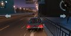</a>

*Left to right: ARM64 `gfxstream`, correct. ARM64 ANGLE — the billboard is
block noise and the road, car body and HUD bar are striped. x86-64 `gfxstream`,
correct at 61% race distance and 51 MPH, billboards intact. x86-64 ANGLE,
correct at 54 MPH — the same title, the same graphics path, and the same
corrupt-on-ARM64 build, clean on RADV.*

Launches and plays on ARM64. Under `gfxstream_guest_angle` its compressed
textures corrupt in gameplay: roadside billboards become coloured block noise,
and the road surface, car body panels, interior and HUD bar draw as vertical
stripes. Geometry, lighting, text and vector UI stay correct. The same build
renders correctly under `gfxstream`, so the fault is in the guest ANGLE path
rather than the host renderer or the ASTC decoder. Its menus and cutscenes
render correctly in both modes, so grade this one from a race.

The same title is clean under ANGLE on x86-64 (RADV), graded in-race at 54 MPH
with sparks, nitro prompt and a second frame at 47 MPH — same build, same
graphics path, different host driver. That means the ANGLE corruption is not a
property of the guest translation path in general; it is specific to how
ANGLE's compressed-texture handling interacts with the Honeykrisp Vulkan
driver on this title's texture set.

On x86-64 the game installs and runs translated through native bridge
(`primaryCpuAbi=arm64-v8a` on an `x86_64,arm64-v8a` device) and renders
correctly in-race under `gfxstream` on RADV, billboards included. Play replaces
a sideloaded copy with its own build on first launch, so let that update finish
before grading. The ANGLE cell is still ungraded on this architecture; until it
is, do not assume the ARM64 ANGLE corruption reproduces here, since the two
hosts run different Vulkan drivers.

### Chromium

<a href="images/chromium-full.jpg">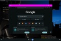</a>

*Page content, icons and text render correctly under `gfxstream`, but the
window title bar draws magenta — the same invalid-color-buffer artifact
described under Graphics paths. Destiny Rising is visible behind it with the
black UI panels from the same fault.*

### Destiny Rising

<a href="images/destiny-rising-full.jpg">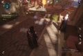</a>
<a href="images/destiny-rising-gfxstream-full.jpg">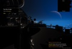</a>

*Left: Haven under ANGLE, correct. Right: the same location under
`gfxstream` — the world is unlit and the minimap, quest and nameplate panels
draw as black rectangles.*

Needs three ROM behaviours together:

1. Writable dynamic DEX, for the packed `classes.dex` it unpacks at runtime.
2. UFFD GC disabled on the 16 KiB guest — ART otherwise takes SIGBUS during
   mark-compact heap relocation.
3. Explicit ART null checks, so NetEase CrashHunter cannot intercept ART's
   internal faults and kill the process.

Uses Vulkan directly, so it is unaffected by the ANGLE compressed-texture issue.
Reaches gameplay and streams its multi-GB asset packs. Not yet graded under
`gfxstream`: it launches, but no verified gameplay frame was captured.

<a href="images/destiny-rising-x86-gfxstream-full.jpg">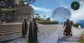</a>

*In-world at Haven on x86-64 under `gfxstream`. World lighting, architecture,
the Traveler, other players, minimap and every HUD panel all render correctly —
compare the ARM64 `gfxstream` result.*

On x86-64 it runs translated through native bridge and is clean under
`gfxstream`, graded in-world rather than from the title screen. This matters
for diagnosis: the unlit world and black UI panels seen under `gfxstream` on
Apple Silicon do **not** reproduce on RADV, so that fault belongs to the ARM64
host stack rather than to the `gfxstream` path itself. Budget for a large
first-run asset download; this install pulled 22 GB before reaching Haven.

### Google Play

<a href="images/google-play-x86-gfxstream-full.jpg"></a>

*Storefront on x86-64 under `gfxstream`, signed in. Promo art, app cards and
the window title bar all render correctly — note the contrast with Chromium,
whose title bar draws magenta in this same mode.*

This build ships MindTheGapps, so Play is the install path for the rest of the
matrix rather than F-Droid, Aurora Store or microG. It is worth tracking as its
own row because a Play problem invalidates every grade taken after it.

Two behaviours to plan around when grading other apps:

- **Play replaces a sideloaded copy with its own build on first launch.** CarX
  Highway Racing was sideloaded from a saved APK set, and Play pulled a 535 MB
  replacement before the game would start. Let that finish, then re-check
  `primaryCpuAbi`, since the replacement decides whether the app runs native or
  translated.
- **Sign-in state is fragile across a factory reset.** `ika reset` clears it
  along with everything else, and re-signing in can take the VM through a
  reboot that silently uninstalls anything sideloaded beforehand. Install games
  *after* Play is signed in, not before.

Only the x86-64 `gfxstream` cell is graded here, from a signed-in storefront on
RADV. The ARM cells are used routinely for installs but have not been captured
and graded, so they stay ungraded rather than assumed.

### Asphalt 8

<a href="images/asphalt-8-x86-gfxstream-full.jpg">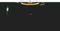</a>

<a href="images/asphalt-8-rewards-full.jpg"></a> <a href="images/asphalt-8-garage-full.jpg">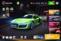</a>

<a href="images/asphalt-8-race-arm-angle-full.jpg">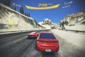</a>

*The confirmed live-race frame: ARM64 under ANGLE, 208 km/h, 2nd/6 position,
Alps track. No corruption anywhere in the scene.*

*ARM64 under ANGLE: post-race rewards screen, and the garage with full-detail car
and character models. No corruption in either, alongside everything else listed below.*

*Mid-race on x86-64 under `gfxstream`. The timer is ticking (01:16 into a 5:00
race), speed and position update, and a coin popup animates — but the track,
car and environment never draw. Only the HUD/vector overlay renders.*

Installs and launches from Play with no device-certification rejection; the
previous all-red row predated any real test on this build. Gets past the age
gate and the GDPR/ad-partner consent dialog, reaches a race, and the process
stays alive with no crash and no tombstone. The 3D scene is fully black for
the whole race while the HUD keeps updating in real time, which rules out a
loading stall. This does not match the `Failed to find ColorBuffer` /
`TextureDraw: GL error` signature described under Graphics paths, so treat it
as a distinct fault rather than the same one.

The failure shape — HUD renders, 3D world does not — mirrors Destiny Rising
under `gfxstream` on ARM64. Worth checking whether `gfxstream_guest_angle`
clears it here the same way it does there before concluding this is
`gfxstream`-wide rather than title-specific.

**ARM64, `gfxstream_guest_angle`: confirmed.** A clean boot (no conflicting
cloud save this time) reached a live race directly. Mid-race capture at 208
km/h, 2nd/6 position, full HUD -- mountains, snow, trees, rock formations, the
guardrail, and the competing car all render correctly with no corruption of
any kind. Combined with the clean title screen, dialogs, loading screen,
rewards screen, garage, and pre-race cinematic already observed, this answers
the open question directly: `gfxstream_guest_angle` clears the black-3D-world
fault seen under `gfxstream` on x86-64, the same way it does for Destiny
Rising.

One purchase dialog appeared mid-flow (a discounted one-time currency/token
bundle) and was dismissed with the Android back button rather than tapping
anywhere near it, since it was a real-money-shaped offer and not something to
risk triggering by accident.

### No Limit Drag Racing 2

<a href="images/no-limit-2-x86-gfxstream-full.jpg">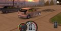</a>
<a href="images/no-limit-2-x86-stage-full.jpg">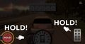</a>

*Left: burnout at the start of a Career race on x86-64 under `gfxstream` —
tachometer sweeping to 5800 rpm, tire smoke, tire-temp gauge live. Right:
staged at the Christmas tree on the drag strip.*

Package is `com.battlecreek.nolimit2`; the old row called it "No Limit 2".
Installs from Play at 575 MB and runs translated through native bridge. Clean
everywhere it was exercised: dealership car model with reflections and shadows,
garage, mode select, race intro, and the in-race drag strip with its
environment, Christmas tree and HUD. The engine responds to injected throttle,
so this is live in-race rendering rather than a menu.

Graded from staging and burnout rather than a moving car, because the launch
requires holding the line-lock button and the throttle **at the same time** and
`adb shell input` only injects one pointer — concurrent `input swipe` calls
serialise instead of overlapping. That is a limitation of the test harness, not
of the game. A moving-car frame needs either real input through the console or
`sendevent`-level multitouch.

## Release smoke set

Grade one cell at a time. A cell is one architecture on one graphics path, and
results carry across neither axis, so a pass elsewhere is not evidence here.

**Per boot**

1. Start the VM in the mode under test: `ika start --gpu_mode=gfxstream` or
   `--gpu_mode=gfxstream_guest_angle`. Confirm `ro.build.date` is the image you
   meant to test, since an upgrade that leaves the composite disk stale makes
   `ika start` refuse with the offending file named — run `ika reset` then.
2. On x86-64 confirm native bridge is live before installing anything ARM-only:
   `getprop ro.product.cpu.abilist` must list `arm64-v8a` alongside `x86_64`.
3. Open the launcher and app drawer. Launch Settings, Files, Chromium, and
   Google Play. Confirm Play is signed in before going further: installs and
   updates run through it, and a signed-out device silently changes what the
   rest of the run is even testing.

**Per app**

4. Install split APKs with `adb install-multiple`; a lone `base.apk` will not
   run. Expect Play to replace a sideloaded copy with its own build on first
   launch, and let that finish before grading. Check `primaryCpuAbi` to confirm
   whether the app is running native or translated.
5. Clear the way to gameplay: dismiss runtime permission dialogs, and let
   in-game asset downloads finish. These are separate from the APK and can run
   to hundreds of megabytes or more.
6. **Grade from actual gameplay.** Menus, garages, title screens and scripted
   cutscenes routinely render correctly while the same title is corrupt
   in-world. For a driving game that means moving under your own input, not
   parked and not mid-cutscene: hold the on-screen accelerate control and
   confirm the speedometer reads non-zero in the same frame you capture.
   `adb shell input swipe X Y X Y 3000` injects a hold; note that
   `input mouse swipe` does *not* work, because on-screen controls only accept
   touch. `adb shell input` also injects only **one** pointer, and concurrent
   calls serialise rather than overlap, so any control needing two fingers at
   once — a drag racing line-lock plus throttle, for example — cannot be driven
   this way. Grade those from live in-world rendering instead and say so, or
   drive them by hand through the console; do not record a harness limit as an
   app failure.
7. Judge the capture by eye. Do not grade from a magenta-pixel count: under
   `gfxstream` a lost color buffer turns whole captures magenta or black
   without any texture being at fault, and coarse block noise does not register
   as striping in a naive filter.
8. Confirm the process survived: still alive and foreground, no fatal signals in
   `adb logcat -b crash`, and no new files in `/data/tombstones`.

**Recording**

9. Update the matrix cell, and add a screenshot for anything that is not a
   plain pass: 120px thumbnail linking to the full-resolution capture, under
   `images/`. Say in the caption which architecture and mode it came from.
10. Record crashes with the top crash frame and the target architecture. If the
    fault is in ART or a system library rather than the app, name the frame —
    `nterp_op_invoke_virtual` and a `fault addr 0x0` mean something very
    different from a fault inside the game's own code.

Every app categorized as `ApplicationInfo.CATEGORY_GAME` is launched fullscreen
by the desktop compatibility policy, regardless of its `resizeableActivity`
declaration. This preserves the lifecycle, input, and surface assumptions common
to games while non-game applications retain normal desktop windowing.
